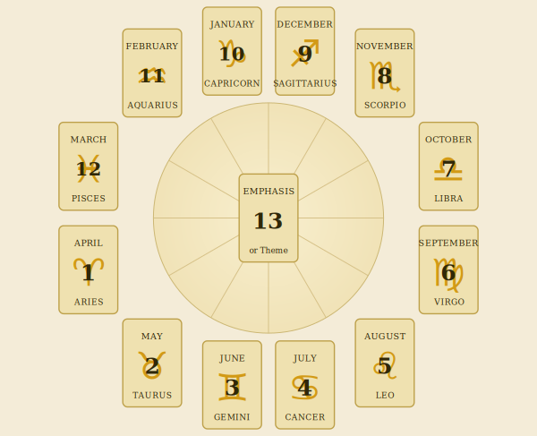
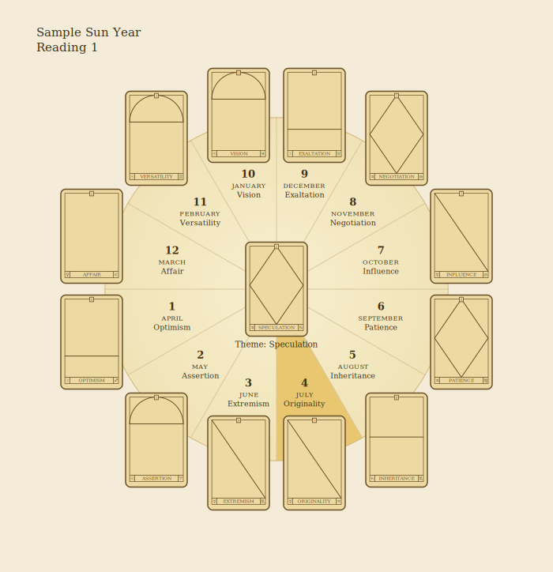
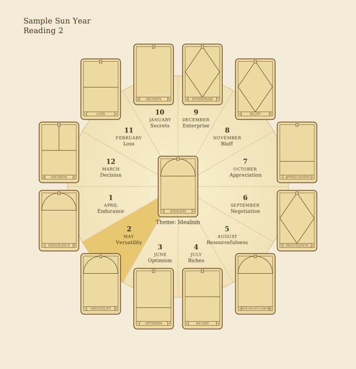
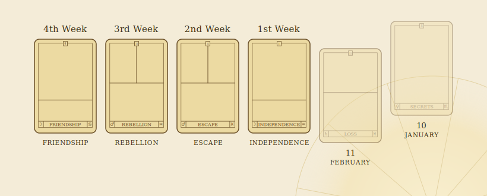

# The Sun Year

Shuffle the deck while contemplating the year to come. To deal twelve cards in a circle, place the first card face down on the left. This represents the Sun in Aries at the vernal equinox in the month of April. From here, continue dealing the cards face down in an counterclockwise direction for each month – May, June, July, and so on – around the Sun wheel, until you have a circle of twelve cards. Place a thirteenth card in the center, as shown in the diagram below.

> *Diagram transcription (p125).* Twelve positions on a wheel, dealt counterclockwise from the left. Each holds a month and its sign: **1** April ♈︎ · **2** May ♉︎ · **3** June ♊︎ · **4** July ♋︎ · **5** August ♌︎ · **6** September ♍︎ · **7** October ♎︎ · **8** November ♏︎ · **9** December ♐︎ · **10** January ♑︎ · **11** February ♒︎ · **12** March ♓︎. The **13th** card sits in the center as the year's *Emphasis or Theme*.

To start your yearly interpretation, look at the card that represents the current month. If this is August, for instance, commence the reading with the fifth card, proceeding month by month around the circle until you reach the month of July in the following year. The central card shows the greatest emphasis or theme of the year.

As you read about the general qualities of each month, some will appear of more interest than others, and these you can amplify. Deal from the top of the deck four more cards to represent the first, second, third and fourth weeks of the month concerned.

If you desire more information about a specific week, deal seven cards for the days of that week, starting, of course, with the Sun's day. The combinations and the possibilities of improvisation with this method are infinite. If you would like guidance on a meeting at three o'clock in the afternoon on a specific day, for example, deal face down fourteen cards, turning the fifteenth card face up (three o'clock being the fifteenth hour in the twenty-four-hour clock system). That card will reveal the nature of the meeting's outcome.

## Sample Sun Year Reading 1

Lena, mother of two small children, came to us for a reading in July. Her husband, Ed, had been forced to retire from farming through ill health, and they had sold their farm and bought a small antique store with plenty of living accommodation above. The following year would be critical for the family, so how did the Sun Oracle predict their progress? We took the fourth card, July, as our starting point for the year's analysis.

> *Diagram transcription (p127).* The dealt spread — **1** April Optimism · **2** May Assertion · **3** June Extremism · **4** July Originality · **5** August Inheritance · **6** September Patience · **7** October Influence · **8** November Negotiation · **9** December Exaltation · **10** January Vision · **11** February Versatility · **12** March Affair · centre (theme) Speculation.

**July — Originality (Mercury in Aquarius).** This card combines the planet Mercury with the sign of Aquarius and represents bright thinking at its best. The sign Aquarius always suggests a different and oddball look at things, and Mercury in the sign demands a new and original approach. Although the couple are taking over a traditional and rather old-fashioned business, the Sun Oracle suggests that they should approach the venture with a completely new vision and that they should also start immediately.

**August — Inheritance (Saturn in Scorpio).** This card is a combination of Saturn with the sign of Scorpio. One of the meanings of Scorpio is shared possessions, and it is in this sign that dealing with other people's money or an inheritance is indicated. It may be that a great uncle leaves a little nest-egg to the couple, but it is much more likely that their new ideas about the business will need further capital. A backer? This could of course also mean pulling in more stock for the store in the form of other people's property.

**September — Patience (Jupiter in Virgo).** Jupiter in Virgo brings a strong earthy influence. Jupiter represents expansion and growth, and in the precise and fussy sign of Virgo seems to suggest an extra amount of time and patience should be applied to accounting. If any card signified a long spell at stock-taking, this is it. Lena and Ed took the business on lock, stock and barrel, with a thousand odd bits and pieces to deal with, so this has to be the month in which everything in the store gets valued and counted.

**October — Influence (Mercury in Libra).** This is one of the coincidences that occur within the Sun oracle cards. This card has arrived in just the right place. If we see the twelve months of the year as the twelve signs of the Zodiac, this Libra card has placed itself harmoniously in the Libra house of the Sun wheel! Airy Mercury in the sign of relationships indicates lots of discussion, new friends and some very sound advice. It's not what you know, it's who you know in the antique business. Through short visits (Mercury) to auction rooms, Lena and Ed are getting to meet the right people and adding to their knowledge. It's an excellent card!

**November — Negotiation (Jupiter in Libra).** Jupiter can relate to legal business, and when it is in Libra it usually denotes some kind of discussion back and forth with regard to a project. Here, the card suggests an important contract or legal document that will further solidify and lead to the eventual success of the year. Dreary stuff, but in a business sense, this is probably one of the more important months of the year.

**December — Exaltation (Moon in Taurus).** This is a great card to deal for feeling comfortable with life – Moon in the sign of Taurus. Traditionally, the moon is in exaltation in this sign. It is a nice comfortable combination that suggests a feeling of well-being with the way things are going. It also indicates possessions, which in one sense can, of course, refer to the store, but at this time of year probably means an extra boost in sales. It is certainly acquisition of some importance: perhaps increased Christmas profits.

**January — Vision (Sun in Pisces).** This is an ethereal card to draw for such a position in the wheel. Moon in Pisces usually indicates strong sympathy for the way others feel, even the ability to know what others are thinking. Translate this into the business that Ed and Lena are concerned with, and you get the interpretation that they are now beginning to tune into their market. In just a few short months, they are sensing the type of stock that will attract the customers they want.

**February — Versatility (Sun in Gemini).** Sun in Gemini is sharp, quick-thinking and constantly on the move. This card suggests versatility and always denotes a period in which one is carrying out a dozen jobs at a time. This is probably an intensive period during which previous profits are converted into new stock. Gemini signifies many short trips, so it looks set to be a month of visits to auction houses, and cash and carry warehouses.

**March — Affair (Venus in Leo).** Wow! When this card turns up, the fireworks usually fly. Venus in Leo is a heart-throbbing love affair! However, we know that Lena and Ed are a happily married couple and are not going to break up a beautiful partnership. So this seems to suggest what we had already suspected. They will be mad about the business, and have a new-found joy in each other's company which was non-existent in the farming years. They love it! The bits, the pieces, the bidding at auctions, the lucky finds and the research. This business will change their life, and above all they will be working together – it *must* be love!

**April — Optimism (Moon in Sagittarius).** Sun and Moon in Sagittarius, this card looks ahead and likes what it sees. What more can we say? This a good, positive reading.

**May — Assertion (Sun in Aries).** Sun in Aries represents self-assertion and consciousness of one's uniqueness. This would suggest that the new coat of paint and change of name Lena and Ed had been planning for the business would be appropriate. They have taken over a going (though somewhat run-down) concern; they will have worked hard and enthusiastically to build something that will be supportive and an enjoyable contribution to their life together. Time to put their mark on it!

**June — Extremism (Mercury in Scorpio).** The tough sign of Scorpio touched by Mercury is the knowledge that what goes up must come down. Nothing stays the same, so things must be kept on the move. This is not a time to rest on one's laurels. The Mercury influence makes it imperative that now is the period during which good publicity will keep up the momentum.

**Central card — Speculation (Jupiter in Cancer).** Finally, the central card sums up the year, and here we have Speculation – not a bad keyword for the entire year.

**The Outcome.** A year later, the pattern of Lena and Ed's business proved amazingly close to the prediction. In December, however, they actually acquired some new property. They bought an old stable block close to their antique store – partly to use for storage, but also with a section for letting. They used an insurance which unexpectedly paid up on Ed's disability in August (the augured inheritance!).

## Sample Sun Year Reading 2

This reading was made in May for Andrea and Martin. After several years teaching fourteen-year-olds in a dreary city suburb, Martin yearned for the simple life, and he and Andrea agreed that they wanted to bring up Jack, their four-year-old son, in a healthy, safe environment. Martin had been left a small inheritance, and they decided to sell up and move to France. The dream was to enjoy a less-pressurized, self-sufficient life with a farmhouse, a little land and a couple of gîtes to let as income. To see how this highly eventful year would progress, we dealt the reading shown opposite. As the astrological year starts in April, the second card, May, is our starter for the year.

> *Diagram transcription (p131).* The dealt spread — **1** April Endurance · **2** May Versatility · **3** June Optimism · **4** July Riches · **5** August Resourcefulness · **6** September Negotiation · **7** October Appreciation · **8** November Bluff · **9** December Enterprise · **10** January Secrets · **11** February Loss · **12** March Decision · centre Idealism (Sun in Aquarius). The printed caption under the centre card reads "Theme: Speculation" — an error carried over from Reading 1; the prose (below) confirms the central card is **Idealism**.

**May — Versatility (Sun in Gemini).** Sun in Gemini is a powerhouse of ideas, and indicates much discussion and planning, with a multitude of alternatives. There is a danger with this card that too many possibilities will confuse the issue, but it nevertheless bodes well for an enthusiastic and excitable start to the project. As always with Gemini, short trips are indicated, and it later proved that Andrea and Martin made a seven-day visit to the Charente region of France to look at a property which a lawyer friend suggested might be just the thing.

**June — Optimism (Moon in Sagittarius).** The symbolism of this card is one of the delights of an astrological reading. The Moon rules houses and family, and Sagittarius governs places abroad or across the sea! It is a card of high hopes, and is emotionally lifting. In the Third-house position here, it suggests great energy thrown into contacting agents and putting into motion the sale of Martin and Andrea's present home, and indicates finding out more about the business of living in another country.

**July — Riches (Saturn in Capricorn).** Often associated with more responsibility and the dreary hard-working aspects of life, the planet Saturn takes on a much happier role here in its own sign, Capricorn. It is careful and ambitious, and watchful that any deal made is sound. The riches are well-earned. In the Fourth-house position, the card indicates that the couple will get a surprisingly good offer for their house just a week or so after putting it up for sale.

**August — Resourcefulness (Sun in Cancer).** As with many of these readings, the repetition of appropriate signs and planets echoes the needs of the question. Sun in Cancer reflects home life again, and in the Fifth House brings the question of children's needs to the fore. The card indicates research into schooling for Jack, with a special regard to the possible new village location, a long way from the nearest town.

**September — Negotiation (Jupiter in Libra).** Jupiter often concerns legal business, and in Libra usually refers to an ongoing discussion about a venture. Here, the card suggests a vital contract or legal document that consolidates and leads towards the success of the year. This is probably one of the key months of the year for business.

**October — Appreciation (Moon in Leo).** This is a great card for feeling that what you are doing is actually gaining the appreciation it deserves. Moon in the sign of Leo particularly relates to children and their well-being. The card's position in the Seventh House suggests that Andrea and Martin's relationship is positively glowing with pleasure, just like a new love affair!

**November — Bluff (Jupiter in Gemini).** This card indicates the move to France. Gemini represents movement and duality (another language) while Jupiter signifies travel and foreign contacts. Jupiter's optimism always promises a little more than it can deliver, and suggests that what our couple do not know, they will have to improvise.

**December — Enterprise (Jupiter in Aries).** Aries is the sign of action, and tells us that this is not going to be a holiday month. Jupiter adds to the drive, indicating four weeks of ceaseless and inventive work to make plans a reality.

**January — Secrets (Venus in Scorpio).** Scorpio is a secretive sign, and combined with the planet Venus usually suggests a hidden love or desire, even passion. As the Tenth-house position invariably puts things into the public eye, we can deduce that something hidden will be revealed this month. Because the overall question concerns the move to France, the card may well indicate an unexpected discovery about the property (Venus rules the Second House of property).

**February — Loss (Saturn in Pisces).** At first sight, this seems to refer to January's card, and may indicate that the revelation will lead to some kind of financial loss. On this, we will have to draw more cards to discover the nature of the loss.

**March — Decision (Mars in Gemini).** Possibly as a result of what happened in February, this month some kind of firm decision will have to be processed. Mars gets ideas moving, and whatever has been decided as the best answer to the current problem will require action.

**April — Endurance (Sun in Scorpio).** One year on, and Sun in Scorpio tells us that this will have been a year of transformation and determination. Scorpio achievements usually come as a result of deliberately rocking one's own boat to bring about change and improvement. It will be a self-testing time; the card describes the nature of the year's adventure.

**Central card — Idealism (Sun in Aquarius).** Finally, the center card sums up the year. Andrea and Martin started the year with a dream – a desire to change their world in some way. Aquarius, like all idealists, feels the need to look at a question in a new or different way.

### Further Investigation

February's Loss card is a worry. By dealing out four more cards at this position, we can define the events of each of the four weeks of the month (see diagram overleaf).

> *Diagram transcription (p134).* The February (Loss) position is expanded into four weekly cards, with the adjacent wheel positions 11 (February) and 10 (January) shown for context. As printed, the diagram's week labels run **4th → 1st** left to right (4th Friendship · 3rd Rebellion · 2nd Escape · 1st Independence) — the reverse of the prose order below.

**First week — Friendship (Moon in Cancer).** This is a card of the emotions, and the keyword of the card underlines the Eleventh-house position, indicating friends. It can signify either a visit from friends or, more likely, contact by letter or phone.

**Second week — Rebellion (Mars in Aquarius).** Here, the Mars influence in the wayward sign Aquarius indicates an argument or a difference of opinion. Aquarius being an air sign, the emphasis is on a verbal disagreement or disapproval.

**Third week — Escape (Mars in Pisces).** Mars always acts on impulse, and Pisces rarely endures confrontation of any kind, so this card indicates running away from trouble. This can be an entirely physical escape or, as indicated by the serene Buddha-like figure on the card, a mental blocking-out of a problem.

**Fourth week — Independence (Moon in Aquarius).** This card takes the pressure off the situation, emphasizing one's own freedom, even detachment, from the influence of others.

**The Outcome.** Two years on and the family are well established in their new life. January's "secret" turned out to be a rather untidy piece of wooded land alongside their new property that, although not shown on the original papers, did, in fact, belong to Andrea and Martin. The "friend" signified a visit from Martin's older brother (never a close relationship) that became insufferable after ten days and resulted in a blazing row, a hasty departure, and a continuing family estrangement. Only one *gîte* is in operation because of lack of funds, but the couple are optimistic and remain enthusiastic.
