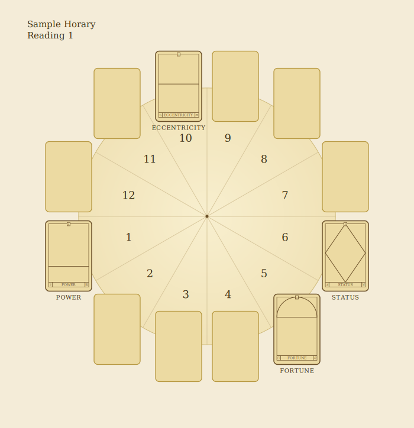
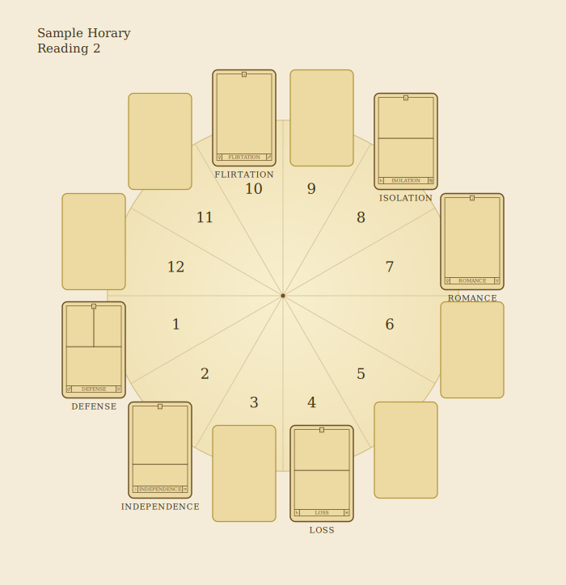
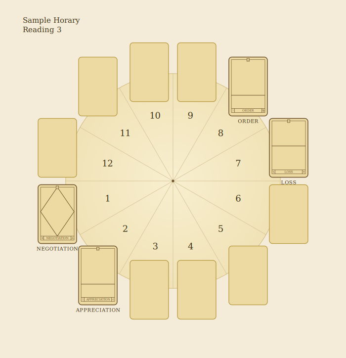

# The Horary Reading

To make this type of reading, first shuffle the cards while thinking about the question you wish to have answered. Deal the cards face down in the same circle of twelve as in the Sun Year reading (see page 125). Then turn upwards only the cards covering the house positions that relate to the question – for example, about questions of finance and possessions, the Second-house position card; about home and family, the Fourth-house position card. (See pages 16–19 to remind yourself which houses relate to which areas of life.) The First-house card always represents the person asking the question.

## Sample Horary Reading 1

The question asked – 'Will I get the job?' (see diagram on page 135) – necessitates that we turn face up the cards that relate to the following houses:

- **First House:** tells about the questioner.
- **Sixth House:** relates to work.
- **Tenth House:** the position of career and status.
- **Fifth House:** for luck and competition.

> *Diagram transcription (p135).* The twelve houses are dealt as in the Sun Year wheel; only the relevant cards are turned face up — **1st** Power · **5th** Fortune · **6th** Status · **10th** Eccentricity.

**First House — Power – Moon in Scorpio.** This shows that the questioner has taken up the challenge and is confident to meet any competition.

**Sixth House — Status – Jupiter in Taurus.** The card dealt at this position probably indicates an important job that will add a great deal to the reputation of the questioner.

**Tenth House — Eccentricity – Saturn in Aquarius.** This card hints that the job will turn out to be different to the one the questioner expects.

**Fifth House — Fortune – Sun in Leo.** It's a winner, no doubt about it – the person asking the question will get the job!

**Summary.** This reading, like most Horary readings, quite obviously gave a yes answer once the relevant cards were revealed. Three Sun cards in the reading gave a pretty good start.

## Sample Horary Reading 2

The question "Will we sell our house to these people?" (see diagram opposite) requires that the cards sitting on the following astrological House positions are brought into play:

- **First House:** tells about the sellers.
- **Second House:** relates to the sellers' money.
- **Seventh House:** the position indicating the buyer.
- **Eighth House:** the card representing the buyer's money.
- **Fourth House:** the House of property.
- **Tenth House:** relates to the value of the property on the market.

> *Diagram transcription (p137).* Cards turned face up — **1st** Defense · **2nd** Independence · **4th** Loss · **7th** Romance · **8th** Isolation · **10th** Flirtation.

**Summary.** On first glance, this reading looks good, except that the property is signified by the Loss card – Saturn in Pisces – but let us explore further.

**First House — Defense – Mars in Taurus.** The sellers are represented by Defense, suggesting an inflexiblity on price and questioning their readiness to sell.

**Second House — Independence – Moon in Aquarius.** Any money in the sellers' bank account? The second House gives the Independence card, suggesting that the sellers are not too concerned either way.

**Seventh House — Romance – Venus in Taurus.** The buyer loves the house – the Romance card indicates that this is love at first sight – so the deal looks good until we look at the buyer's cash.

**Eighth House — Isolation – Saturn in Virgo.** The money is a problem and there is a possibility that the buyers don't like the price. Virgo is supercritical and sometimes a little more modest than most when paying for their pleasures.

**Fourth House — Loss – Saturn in Pisces.** This is a worrying card to uncover in the House of property.

**Tenth House — Flirtation – Venus in Sagittarius.** When we look at the Tenth House to assess the value of the property on the market, we are given the Flirtation card. This suggests that the whole deal is not too serious a possibility. The potential buyers are probably typical time-wasters just curious to view.

Maybe the Loss card indicates that the sellers do not really want to part with their lovely house. In the end, the questioners don't sell but are not too worried about it.

## Sample Horary Reading 3

The question "Should my son marry this woman friend and can they afford it?" (see diagram opposite) can be answered by assessing the significance of the cards placed on the following House positions:

- **First House:** relates to the son.
- **Second House:** the position concerning his finances.
- **Seventh House:** the card associated with the woman friend.
- **Eighth House:** relates to her finances.

> *Diagram transcription (p139).* Cards turned face up — **1st** Negotiation · **2nd** Appreciation · **7th** Loss · **8th** Order.

**Summary.** Here, an extravagant man, not entirely convinced about what he wants, is in a relationship with a cautious woman.

**First House — Negotiation – Jupiter in Libra.** The son is represented by Negotiation – the Libra aspect of this combination shows he is not sure what he wants.

**Second House — Appreciation – Moon in Leo.** As the son's finances are governed by Leo, it suggests that he is extravagant and appreciates beautiful things.

**Seventh House — Loss – Saturn in Pisces.** The woman friend is signified by the Loss card. Perhaps she worries about losing what she currently has – money or freedom one might infer.

**Eighth House — Order – Moon in Virgo.** Since the woman's money is governed by Order, she is probably careful with money and orderly. Tell mother not to worry: this union will never happen.
