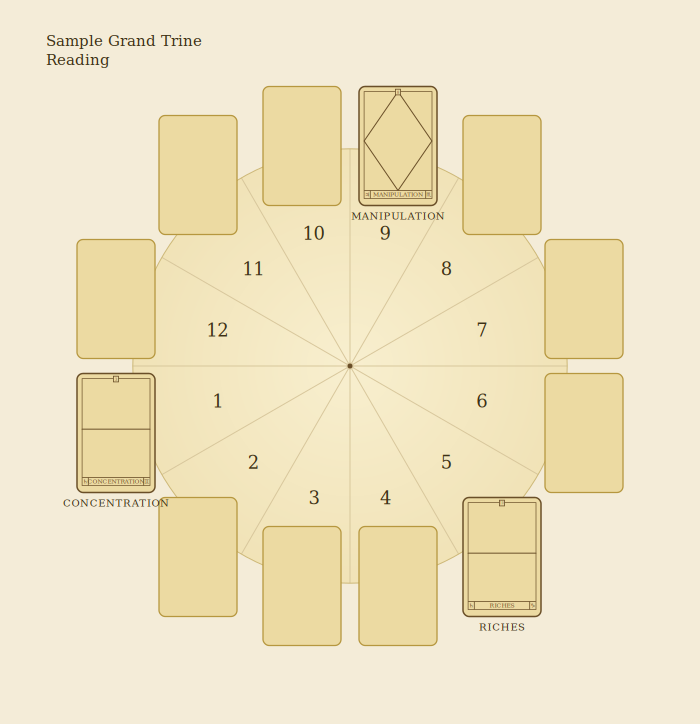
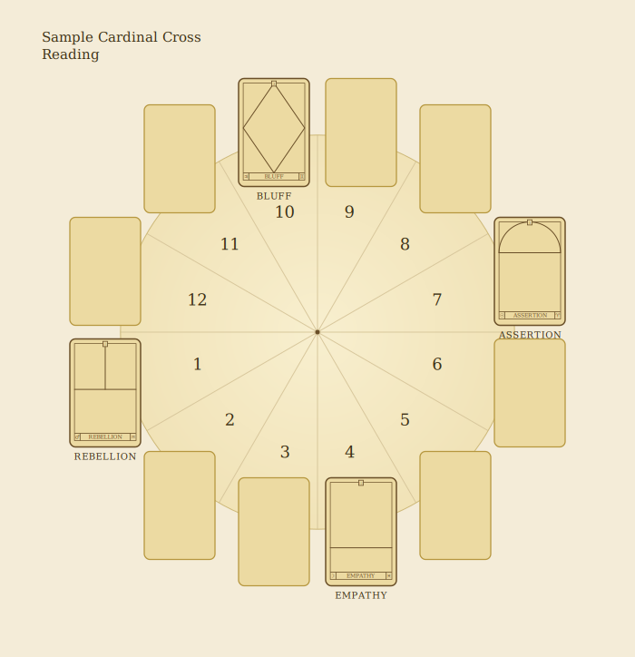

# Other Types of Reading

The Sun cards can be used for other types of reading – some traditional Tarot methods give interesting results. Astrology allows for rich possibilities with this deck, and experienced astrologers will discover their own ways of reading.

The divisions of the 360-degree circle of the zodiac are an important aspect of astrology. Based on these, we have experimented with two new types of readings, the Grand Trine (an aspect 120 degrees apart) using three cards, and the Cardinal Cross (90 degrees apart) using four cards. You might experiment with these methods to give readings that answer general questions. The Cardinal Cross reading is particularly good for simple, short readings for one or two people at, perhaps, a dinner party. Make each reading in private: they can be quite revealing.

## Grand Trine Reading

Shuffle the cards while thinking about a specific question, or concentrate on how things are going for you at the moment, at work, at home or in love, for example. Deal out the twelve cards of the zodiac circle in the usual way, but turn over only the three cards of the First, Fifth and Ninth Houses, as shown opposite.

### Sample Grand Trine Reading

In the deal pictured opposite, we asked for general information on behalf of a friend who works in the media, and so turned over the following cards:

- **First House:** describes the questioner.
- **Fifth House:** the questioner's creativity.
- **Ninth House:** indicates how the questioner will expand his or her life.

> *Diagram transcription (p141).* The three trine houses (1, 5, 9 — 120° apart) turned face up: **1st** Concentration · **5th** Riches · **9th** Manipulation.

**Summary.** The reading gives this interpretation of the questioner's working life.

**First House — Concentration (Saturn in Gemini).** Drawing the Concentration card in the First House indicates that the person asking the question has been applying themself to a period of patient and concentrated work.

**Fifth House — Riches (Saturn in Capricorn).** Creatively, the subject of the reading is blessed with abundant talent.

**Ninth House — Manipulation (Jupiter in Scorpio).** The questioner's life will be enhanced by the power of her work to influence.

## Cardinal Cross Reading

Shuffle the cards while pondering a specific question, or just think about an area of life that concerns you at the moment. Deal out the twelve cards of the zodiac circle as usual, but turn up only the four angular cards: the First, Fourth, Seventh and Tenth House positions, as demonstrated in the diagram opposite.

### Sample Cardinal Cross Reading

In the deal shown pictorially opposite, Joan asked for a general reading.

- **First House:** concerns personality.
- **Fourth House:** about home and family.
- **Seventh House:** relationships/marriage.
- **Tenth House:** career or achievement.

> *Diagram transcription (p143).* The four angular houses (1, 4, 7, 10 — 90° apart) turned face up: **1st** Rebellion · **4th** Empathy · **7th** Assertion · **10th** Bluff.

**Summary.** Joan is ready for change, and about to act in a way considered out of character.

**First House — Rebellion (Mars in Aquarius).** Here, this card indicates rebellion against one's personality – Joan's discontent with how the world sees her.

**Fourth House — Empathy (Moon in Pisces).** For her family, Joan is their shoulder to cry on. The sign of Pisces, with its great sensitivity, is particularly vulnerable to becoming what others want it to be.

**Seventh House — Assertion (Sun in Aries).** In a relationship, this card indicates the need to take a stand. Aries action, immediate and truthful, must be taken. All Sun cards are good, so whatever happens here will clear the air.

**Tenth House — Bluff (Jupiter in Gemini).** At work, Jupiter indicates expansion: perhaps Joan will take on more than she is used to with her makeover.

## Further Possibilities

The possibilities for extending these different methods of making a reading are endless, and, with practice, everyone will find the method that suits them best. You might like to try dealing one card each for yourself and a partner; one card for a day, seven cards for a week, and so on. Use your instinct with your expanding experience, and don't be afraid of experimentation. Good luck!
