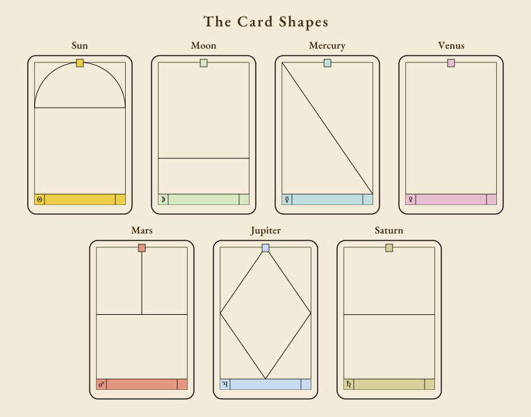

# The Oracle Cards

To make recognition of the seven planetary suits in the deck of eighty-four cards immediate, artist Caroline Smith has given each suit a different representation (see outlines below). The illustrations are her own instinctively inspired interpretation of the meanings of the cards, and use powerful figurative and symbolic imagery. No two people see or interpret images in the same way. Each symbol means different things to different eyes. Regular practice will extend your impressions of the truths behind the images and develop your own instinctive understanding of the cards.

The interpretations that follow, based on traditional astrology, form a starting point – how you use them is your creative challenge. We describe first the personality type arising from the planet-sign combination, assess what the card indicates in a reading, and outline events associated with it.

## The Card Shapes

> *Diagram transcription.* Each suit's cards carry a distinctive border motif so the suit can be recognized at a glance:
>
> - **Sun** – a semicircular arch (dome) spanning the upper portion of the card, its chord forming a horizontal line roughly one-third of the way down.
> - **Moon** – two horizontal lines: one across the upper quarter of the card and one across the lower two-thirds, dividing the face into three horizontal bands.
> - **Mercury** – two diagonal lines crossing corner to corner inside the inner frame, forming an X.
> - **Venus** – a plain panel framed by a simple border, with no additional motif.
> - **Mars** – a short vertical stem descending from the top centre meeting a full horizontal line at mid-height, forming an inverted T.
> - **Jupiter** – a large diamond (rhombus) centred on the card, with a short vertical stem connecting its top vertex to the upper inner border.
> - **Saturn** – a single horizontal line set across the upper third of the card.
